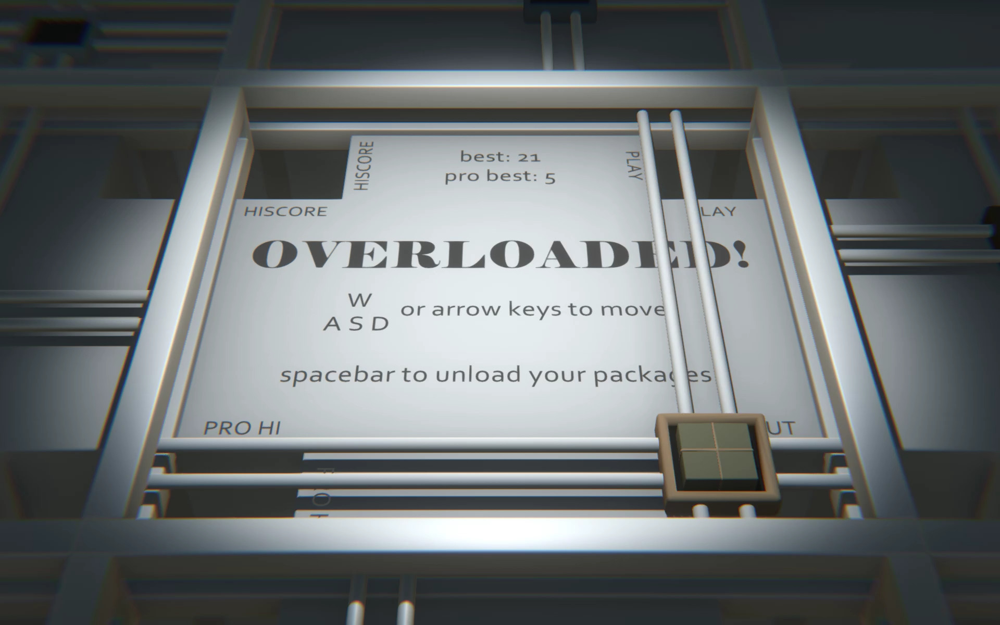
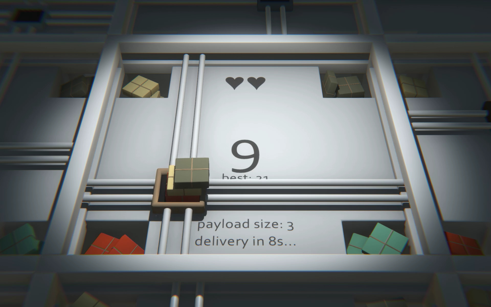
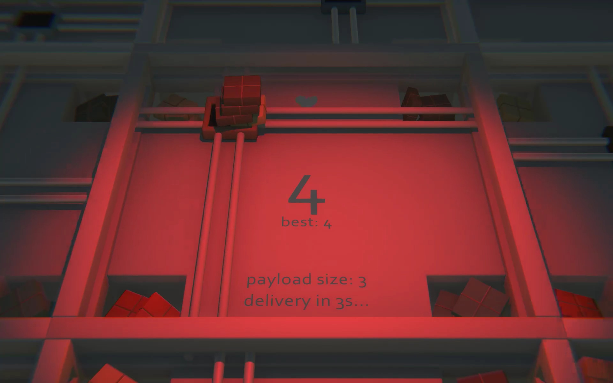
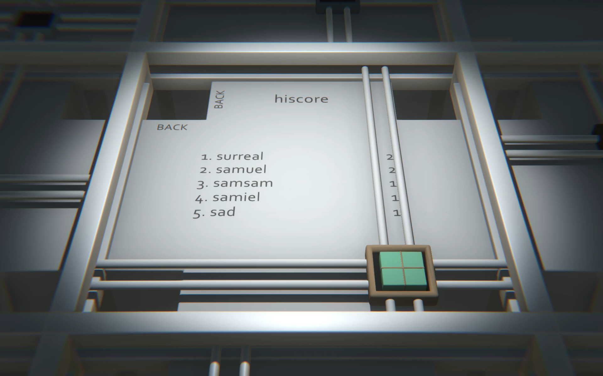

# OVERLOADED!

A fast-paced warehouse delivery game created with Unity in 48 hours for Ludum Dare 51 with the theme "Every 10 Seconds"

### Links

- [Play on itch.io](https://busisen.itch.io/overloaded)
- [Ludum Dare Entry](https://ldjam.com/events/ludum-dare/51/overloaded)

## About

In OVERLOADED!, you play as a warehouse delivery robot with one simple task: deliver as many packages as robotanly possible until you physically can't continue. Remember, robots that don't do their job get replaced!

## Controls

- WASD / arrow keys - Move around
- Hold spacebar - Unload packages

## How to Play
- Every 10 seconds, packages fall from the ceiling
- Catch and deliver them to the correct deposits
- Deliveries increase over time

## Screenshots

